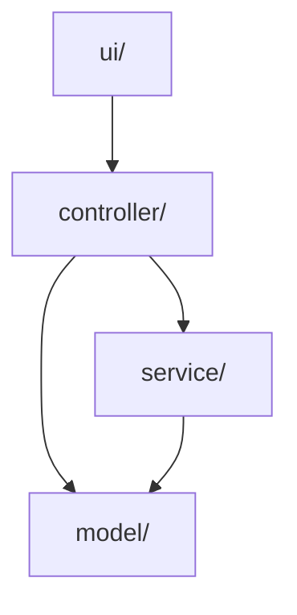
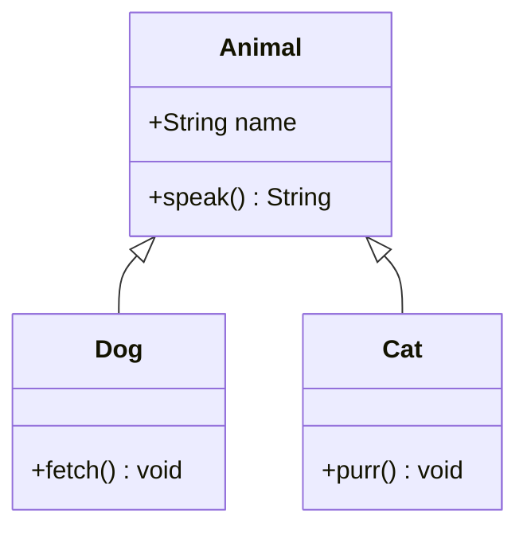
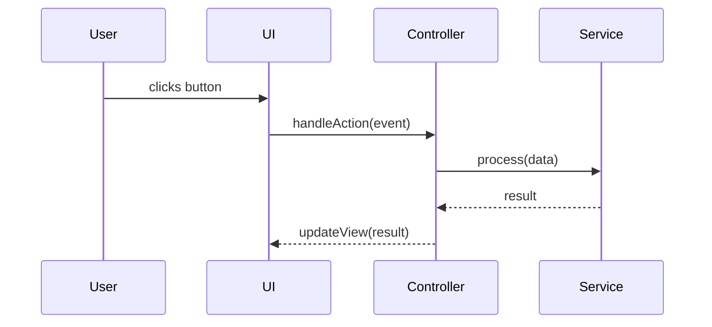

# AI Instructions - Architecture Documentation

This file defines how to document project architecture, including per-component breakdowns and diagrams.

---

## Component Breakdown by Package/Folder

Document each package or top-level folder as a subsection. Within each subsection, document every meaningful file or class.

### Package Subsection Format

```markdown
### `package-or-folder-name/`
Brief sentence on what this package is responsible for.

#### `FileName.java`
- **Pattern**: Design pattern used (if applicable)
  - Examples: Singleton, Abstract base class, Enum, Utility class
- **Purpose**: High-level description of what the component does
- **Responsibilities**:
  - Responsibility one
  - Responsibility two
- **Error Handling**: How this component handles errors (if applicable)
- **Usage**: How other components use this one (if applicable)
- **Future Enhancement**: Planned improvements (if applicable)
```

### Example

```markdown
### `ui/`
Handles all Swing-based UI panels and the main application window.

#### `GameWindow.java`
- **Pattern**: Singleton
- **Purpose**: Main game window (JFrame)
- **Responsibilities**:
  - Manage the application window lifecycle
  - Handle panel switching
  - Configure window properties

#### `MenuPanel.java`
- **Pattern**: Abstract base class
- **Purpose**: Base for all menu screens
- **Responsibilities**:
  - Render navigation buttons
  - Delegate user actions to the controller
```

---

## Project Diagrams

Diagrams in README.md use [Mermaid](https://mermaid.js.org/), which renders natively on GitHub and most markdown viewers. Always wrap diagrams in a fenced code block tagged `mermaid`.

### When to Add a Diagram

Include a diagram whenever a relationship, flow, or structure is hard to convey in prose alone:

- **Package/module structure** — how top-level folders relate to each other
- **Key class relationships** — inheritance, composition, or dependency between important classes
- **Data or control flow** — the lifecycle of a request, event, or game loop step

Diagram every class. Every class must appear in at least one diagram.

### Diagram Types and When to Use Each

| Type | Mermaid keyword | Use for |
|---|---|---|
| Package/component map | `graph TD` | High-level overview of how packages depend on each other |
| Class relationships | `classDiagram` | Inheritance hierarchies or composition between important classes |
| Sequence / flow | `sequenceDiagram` or `flowchart TD` | Step-by-step lifecycle of a key process |

### Package/Component Map

Show how the top-level packages depend on or communicate with each other. Use directional arrows to indicate dependency (`A --> B` means A depends on B).



Guidelines:
- One node per top-level package or major subsystem
- Arrow direction = dependency direction (caller → callee)
- Always add a short label on every arrow: `UI -->|"dispatches events"| Controller`
- Keep it flat — avoid nesting unless the project has a clear layered architecture

### Class Relationship Diagram

Use when inheritance or composition is a central design choice worth highlighting.



Guidelines:
- Include ALL classes in the project, not just those that appear in the component breakdown
- Use `<|--` for inheritance, `*--` for composition, `o--` for aggregation, `-->` for dependency
- Omit trivial getters/setters; only list fields and methods that clarify the design

### Sequence / Flow Diagram

Use for the lifecycle of a key runtime process (e.g., a game loop tick, a request handler, an agent reasoning step).



Guidelines:
- Cover one process per diagram; do not try to show the entire system in one sequence
- Use `-->>` (dashed) for return messages, `->>` (solid) for calls
- Label every arrow with the method or event name

### Placement in DIAGRAMS.md

Diagrams must **not** go in README.md. Place all diagrams in a dedicated `DIAGRAMS.md` file at the project root.

- Place the **package/component map** at the top of `DIAGRAMS.md`
- Place **class diagrams** grouped by package, after the component map
- Place **flow diagrams** in a dedicated "Key Flows" section at the end of `DIAGRAMS.md`
