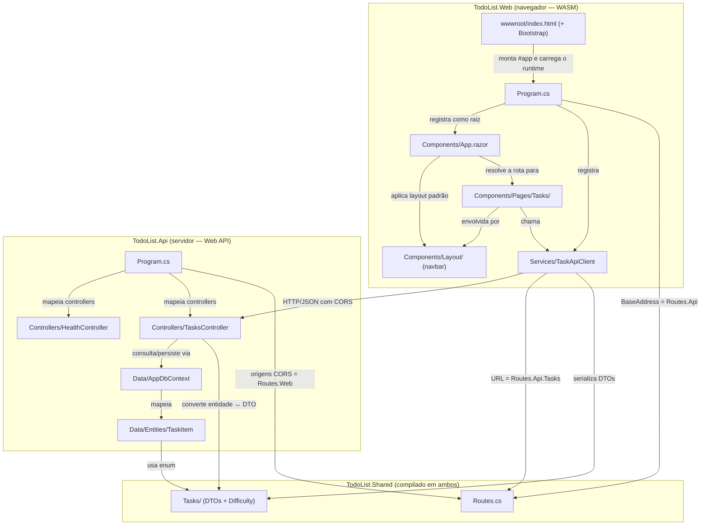
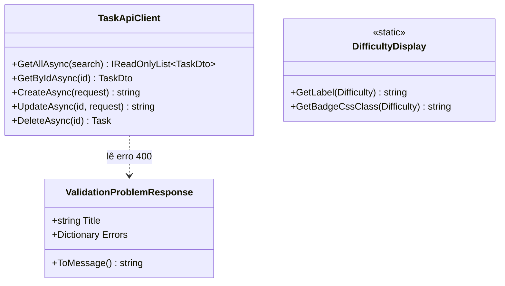
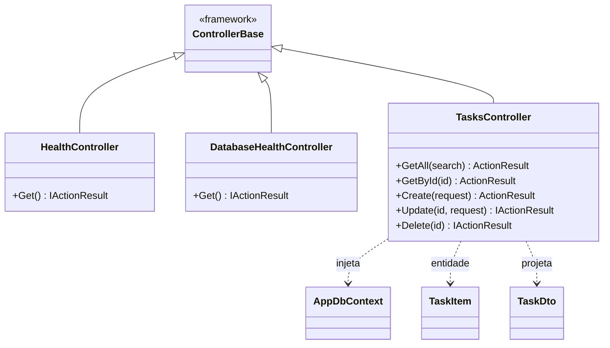
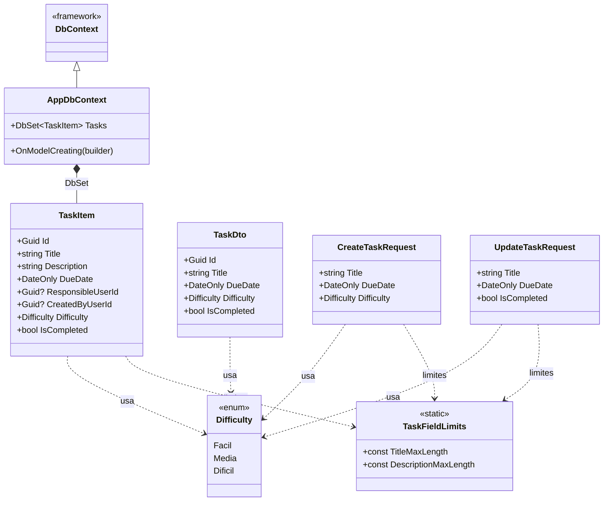
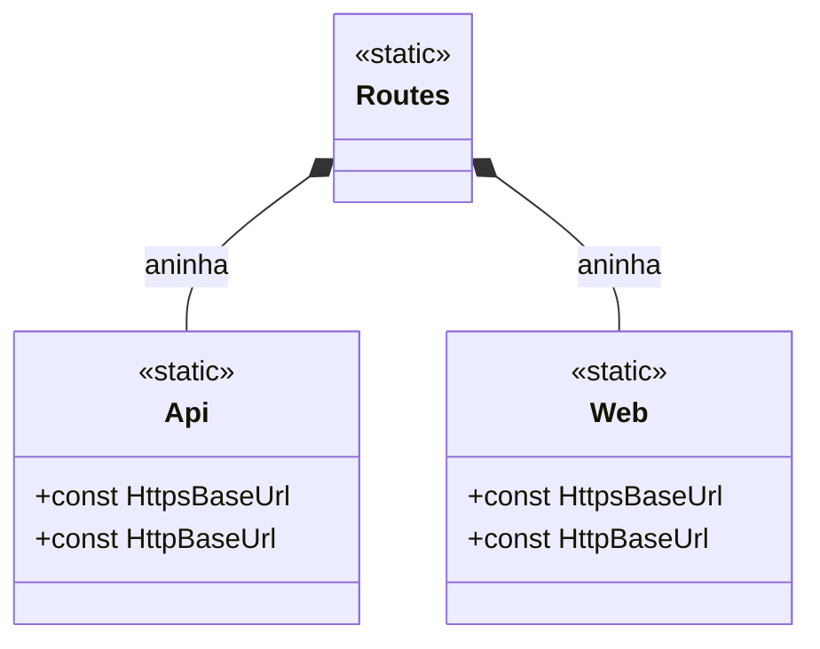
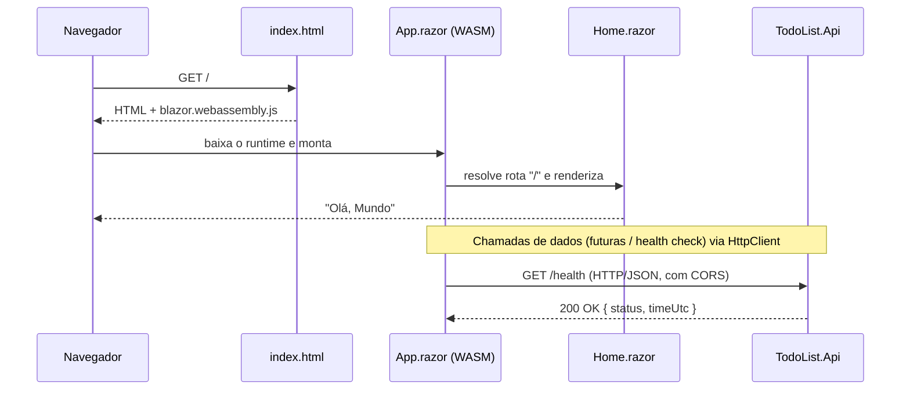
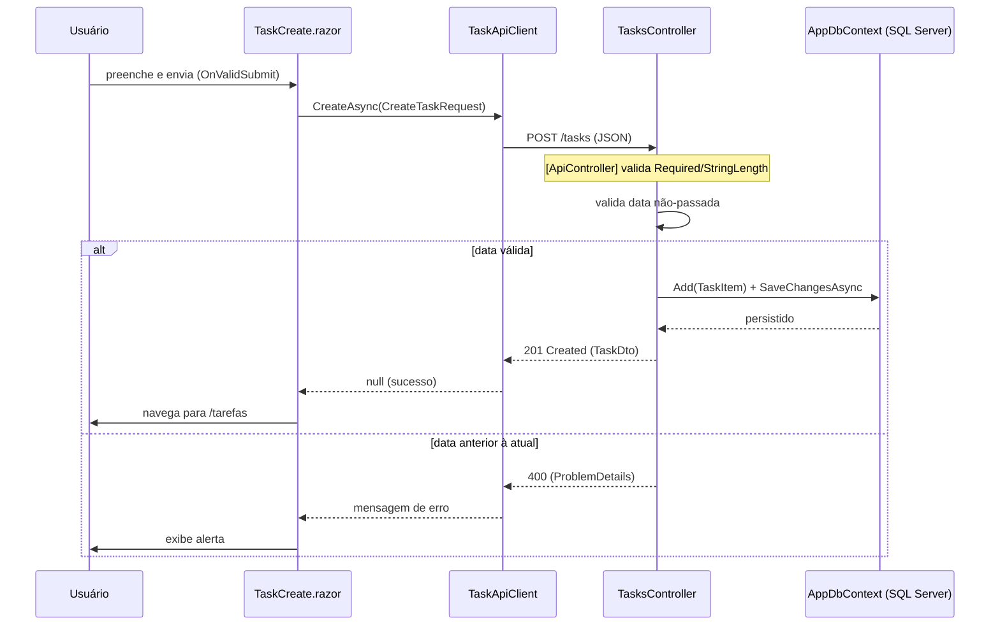

# DIAGRAMS

Diagramas da arquitetura do projeto, em [Mermaid](https://mermaid.js.org/). 

A organização deste arquivo segue as instruções em [`.claude/ARCHITECTURE.md`](../.claude/ARCHITECTURE.md).

O detalhamento textual de cada componente fica em [`ARCHITECTURE.md`](ARCHITECTURE.md).

---

## Mapa de componentes

Como os projetos e os componentes de nível raiz se relacionam. A direção da seta indica a dependência (quem chama → quem é chamado). A fronteira HTTP separa o que roda no navegador do que roda no servidor.



---

## Diagramas de classe

### Componentes Blazor (`TodoList.Web`)

Hierarquia dos componentes Blazor. Todo componente `.razor` deriva (direta ou implicitamente) de `ComponentBase`; layouts derivam de `LayoutComponentBase`.

    As classes de framework aparecem apenas para situar a herança.

```mermaid
classDiagram
    class ComponentBase {
        <<framework>>
    }
    class LayoutComponentBase {
        <<framework>>
        +RenderFragment Body
    }
    class App {
        +Router
        +DefaultLayout = MainLayout
    }
    class MainLayout {
        +renderiza Body em main
    }
    class Home {
        +rota "/"
        +exibe "Olá, Mundo"
    }
    class TaskList {
        +rota "/tarefas"
        +accordion + filtro
    }
    class TaskCreate {
        +rota "/tarefas/nova"
        +POST /tasks
    }
    class TaskEdit {
        +rota "/tarefas/{id}/editar"
        +PUT /tasks/{id}
    }

    ComponentBase <|-- LayoutComponentBase
    ComponentBase <|-- App
    ComponentBase <|-- Home
    ComponentBase <|-- TaskList
    ComponentBase <|-- TaskCreate
    ComponentBase <|-- TaskEdit
    LayoutComponentBase <|-- MainLayout

    App ..> MainLayout : usa como layout
    App ..> Home : roteia para
    MainLayout *-- Home : envolve via Body
    TaskList ..> TaskApiClient : usa
    TaskCreate ..> TaskApiClient : usa
    TaskEdit ..> TaskApiClient : usa
```

### Serviços e apresentação do frontend (`TodoList.Web`)



### Controllers (`TodoList.Api`)



### Persistência e contrato de tarefas (`TodoList.Api` + `TodoList.Shared`)

A entidade `TaskItem` (servidor) é convertida nos DTOs do contrato (compartilhados). Todos referenciam o enum `Difficulty`; os limites de texto vêm de `TaskFieldLimits`.



### Rotas compartilhadas (`TodoList.Shared`)

Classe estática que concentra as URLs base, agrupadas por serviço em duas classes estáticas aninhadas. Consumida tanto por `TodoList.Web` quanto por `TodoList.Api`.



---

## Fluxos principais

### Carregamento do app WASM e chamada à API

Lifecycle desde a abertura da página no navegador até uma chamada HTTP à API.



### Criação de uma tarefa (CRUD)

Do envio do formulário até a persistência no banco, incluindo a validação da data no servidor.


