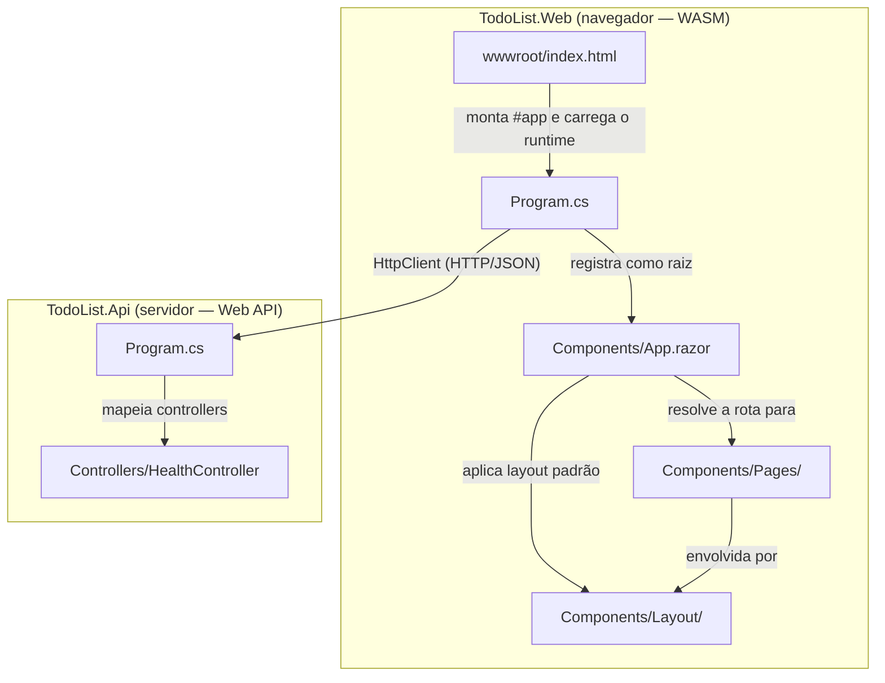
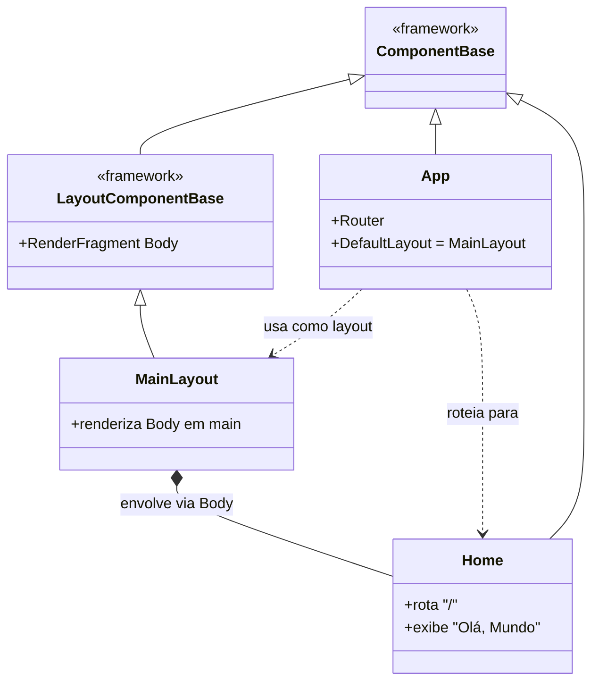
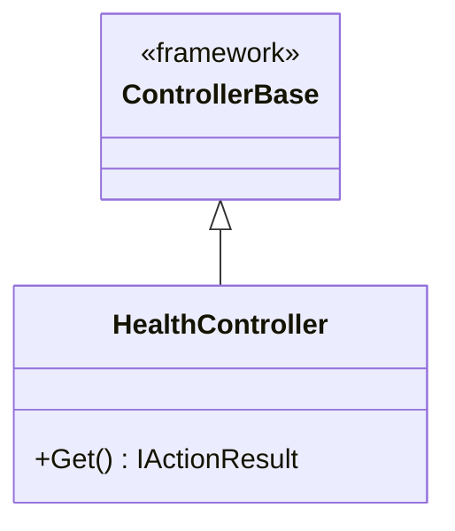
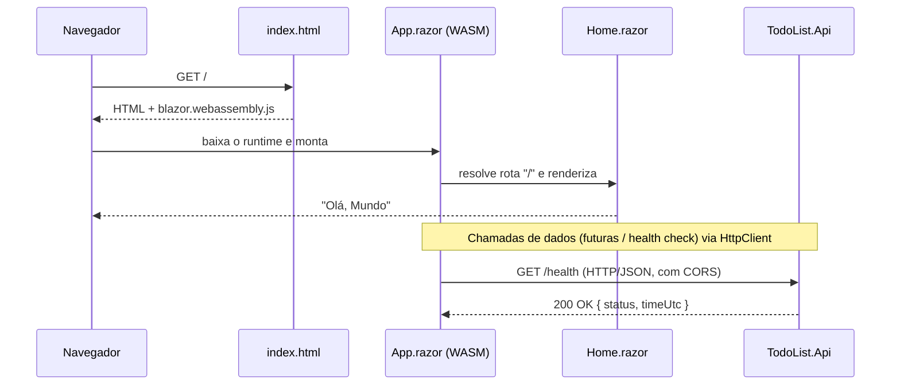

# DIAGRAMS

Diagramas da arquitetura do projeto, em [Mermaid](https://mermaid.js.org/). A organização deste
arquivo segue as instruções em [`.claude/ARCHITECTURE.md`](../.claude/ARCHITECTURE.md): primeiro o
mapa de componentes, depois os diagramas de classe e, por fim, os fluxos.

O detalhamento textual de cada componente fica em [`ARCHITECTURE.md`](ARCHITECTURE.md).

> **Estado atual:** dois projetos separados — `TodoList.Web` (Blazor WebAssembly, roda no navegador)
> e `TodoList.Api` (.NET Web API). Cada um exibe/expõe apenas o mínimo atual (página "Olá, Mundo" e
> endpoint `GET /health`). Os diagramas abaixo refletem apenas o que já existe.

---

## Mapa de componentes

Como os projetos e os componentes de nível raiz se relacionam. A direção da seta indica a
dependência (quem chama → quem é chamado). A fronteira HTTP separa o que roda no navegador do que
roda no servidor.

---

## Diagramas de classe

### Componentes Blazor (`TodoList.Web`)

Hierarquia dos componentes Blazor. Todo componente `.razor` deriva (direta ou implicitamente) de
`ComponentBase`; layouts derivam de `LayoutComponentBase`. As classes de framework aparecem apenas
para situar a herança.

### Controllers (`TodoList.Api`)

---

## Fluxos principais

### Carregamento do app WASM e chamada à API

Lifecycle desde a abertura da página no navegador até uma chamada HTTP à API.

