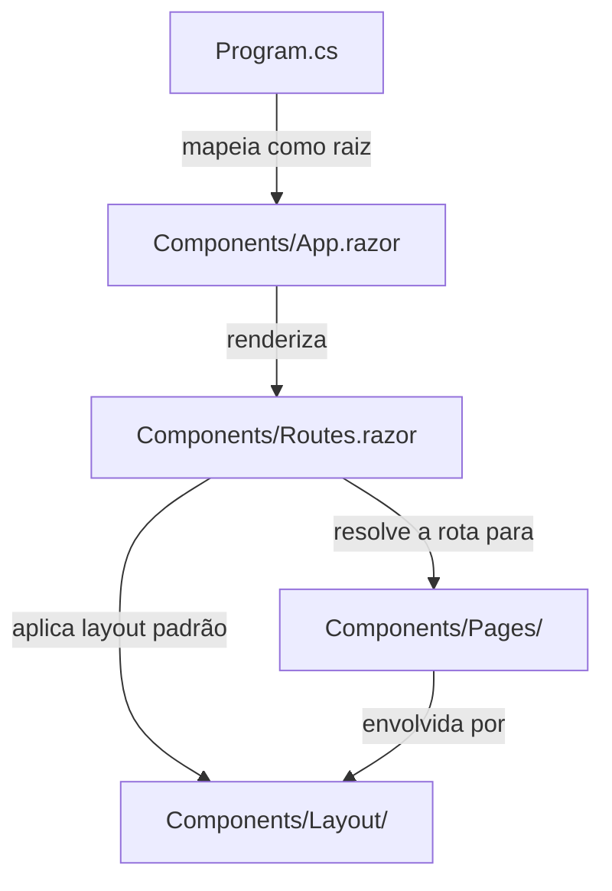
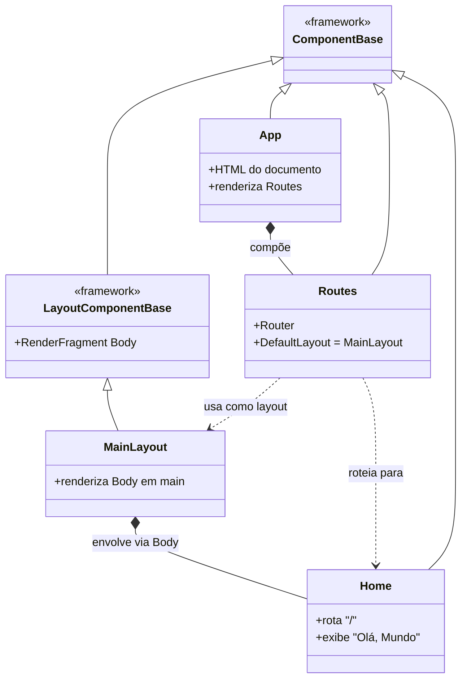
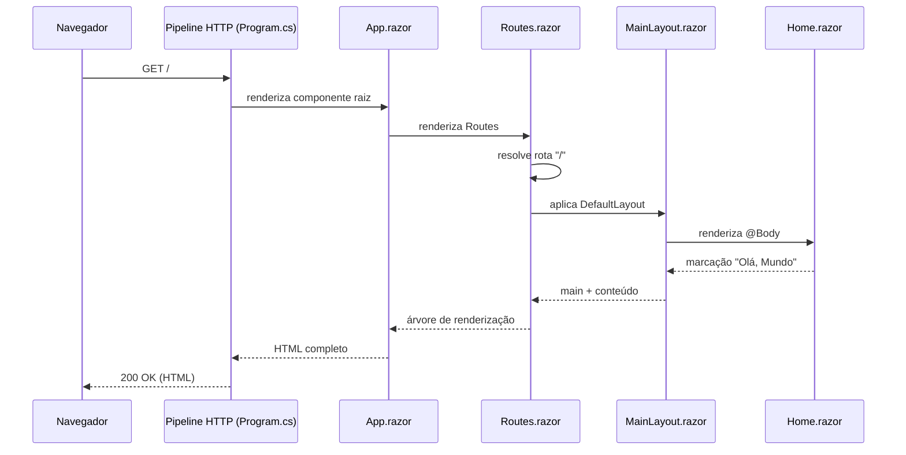

# DIAGRAMS

Diagramas da arquitetura do projeto, em [Mermaid](https://mermaid.js.org/). A organização deste
arquivo segue as instruções em [`.claude/ARCHITECTURE.md`](../.claude/ARCHITECTURE.md): primeiro o
mapa de componentes, depois os diagramas de classe e, por fim, os fluxos.

O detalhamento textual de cada componente fica em [`ARCHITECTURE.md`](ARCHITECTURE.md).

> **Estado atual:** o projeto é um *scaffold* Blazor com renderização estática (SSR) e uma única
> página. Os diagramas abaixo refletem apenas o que já existe.

---

## Mapa de componentes

Como as pastas/componentes de nível raiz se relacionam. A direção da seta indica a dependência
(quem chama → quem é chamado).

---

## Diagramas de classe

Hierarquia dos componentes Blazor. Todo componente `.razor` deriva (direta ou implicitamente) de
`ComponentBase`; layouts derivam de `LayoutComponentBase`. As classes de framework aparecem
apenas para situar a herança.

---

## Fluxos principais

### Ciclo de uma requisição de página (SSR)

Lifecycle de uma requisição HTTP até a renderização estática da página inicial.

